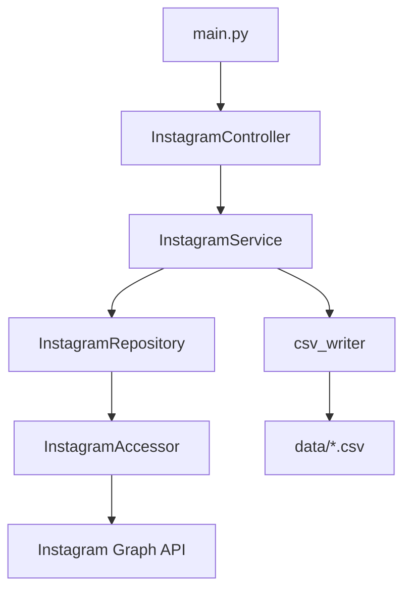

# functional-design.md — 機能設計書

## アーキテクチャ

4層のレイヤー構成。各層は単方向に依存し、下位層の実装詳細を上位層から隠蔽する。

## コンポーネント設計

### Controller — `src/controllers/instagram_controller.py`

エントリポイント。Service を呼び出し、未捕捉例外をログに記録する。

### Service — `src/services/instagram_service.py`

フロー制御を担う。Repository からデータを取得し、フェーズ判定を行い CSV に書き出す。

**責務：**
- 4つの CSV ファイルへの書き出し制御
- `_should_snapshot()` によるフェーズ判定

### Repository — `src/repositories/instagram_repository.py`

API 呼び出しとモデル変換を担う。ページング・インサイト取得・ハッシュタグ抽出を行う。

**責務：**
- `fetch_medias()` — 全投稿取得（ページング対応）
- `fetch_stories()` — アクティブなストーリーズ取得
- `fetch_account()` — アカウント情報と日次インサイト取得

### Accessor — `src/common/instagram/instagram_accessor.py`

Instagram Graph API の HTTP クライアント。Singleton パターンで実装。

**責務：**
- `get(path, params)` — GET リクエスト送信（tenacity でリトライ）
- `parse_insights(response)` — 時系列インサイトのパース
- `parse_total_value_insights(response)` — total_value 形式インサイトのパース

---

## データモデル

### InstagramMedia

| フィールド | 型 | 説明 |
|---|---|---|
| id | str | 投稿 ID |
| timestamp | str | 投稿日時（ISO 8601） |
| caption | str? | キャプション |
| media_type | str | IMAGE / VIDEO / CAROUSEL_ALBUM |
| media_product_type | str | FEED / REELS |
| permalink | str | 投稿 URL |
| media_url | str? | メディア URL |
| thumbnail_url | str? | サムネイル URL（動画のみ） |
| like_count | int | いいね数 |
| comments_count | int | コメント数 |
| is_comment_enabled | bool | コメント許可フラグ |
| hashtags | list | キャプションから抽出したハッシュタグ |
| reach | int? | リーチ数 |
| saved | int? | 保存数 |
| shares | int? | シェア数 |
| profile_visits | int? | プロフィールへの遷移数（FEED のみ） |
| follows | int? | フォロー数（FEED のみ） |
| total_interactions | int? | 合計インタラクション数 |
| fetched_at | str | 取得日時（ISO 8601） |

### InstagramStory

| フィールド | 型 | 説明 |
|---|---|---|
| id | str | ストーリー ID |
| timestamp | str | 投稿日時（ISO 8601） |
| media_url | str? | メディア URL |
| permalink | str? | ストーリー URL |
| reach | int? | リーチ数 |
| replies | int? | 返信数 |
| fetched_at | str | 取得日時（ISO 8601） |

### InstagramAccount

| フィールド | 型 | 説明 |
|---|---|---|
| username | str | ユーザー名 |
| biography | str? | プロフィール文 |
| followers_count | int | フォロワー数 |
| follows_count | int | フォロー数 |
| media_count | int | 投稿数 |
| reach | int? | リーチ数（日次） |
| profile_views | int? | プロフィール閲覧数（日次） |
| website_clicks | int? | ウェブサイトクリック数（日次） |
| fetched_at | str | 取得日時（ISO 8601） |

---

## CSV 出力仕様

出力先はホストの `../../footprints/instagram/`（Docker bind mount 経由）。

| ファイル | モード | 対象モデル | 説明 |
|---|---|---|---|
| `media.csv` | 上書き | InstagramMedia | 実行時点の全投稿スナップショット |
| `media_snapshots.csv` | 追記 | InstagramMedia（一部カラム） | フェーズ判定を通過した時系列記録 |
| `stories.csv` | 上書き | InstagramStory | 実行時点のアクティブなストーリーズ |
| `account_snapshots.csv` | 追記 | InstagramAccount | 毎実行時のアカウント指標記録 |

### media_snapshots.csv のカラム

`id`, `fetched_at`, `like_count`, `comments_count`, `reach`, `saved`, `shares`, `profile_visits`, `follows`, `total_interactions`

---

## フェーズスナップショット仕様

投稿の経過時間に応じてスナップショット取得間隔を変える。直後の急激な伸びを細かく捉えつつ、古い投稿の記録頻度を下げる。

| 投稿経過時間 | 取得間隔 |
|---|---|
| 〜 1時間 | 15分ごと |
| 〜 24時間 | 1時間ごと |
| 〜 7日 | 1日ごと |
| 7日以降 | 7日ごと |

**判定ロジック：** 前回の `fetched_at` からの経過時間が、そのフェーズの間隔を超えている場合にのみスナップショットを記録する。

---

## Instagram Graph API 制約（v22.0 〜 v25.0）

| メトリクス | 対象 | 状況 |
|---|---|---|
| `impressions` | メディア | v22.0 で廃止 → null 保存 |
| `plays` | リール | v22.0 で廃止 → null 保存 |
| `video_views` | リール | REELS 種別では取得不可 → null 保存 |
| `profile_visits`, `follows` | リール | REELS 種別では取得不可 → null 保存 |
| `impressions` | アカウント | v25.0 で廃止 → null 保存 |
| `taps_forward`, `taps_back`, `exits` | ストーリー | v25.0 で廃止 → null 保存 |
| `profile_views`, `website_clicks` | アカウント | `metric_type=total_value&period=day` が必要 |

FEED と REELS では取得するインサイト指標が異なるため、Repository 内で `media_product_type` に応じてメトリクスを切り替える。
